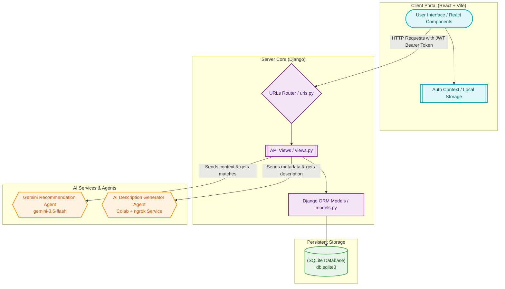
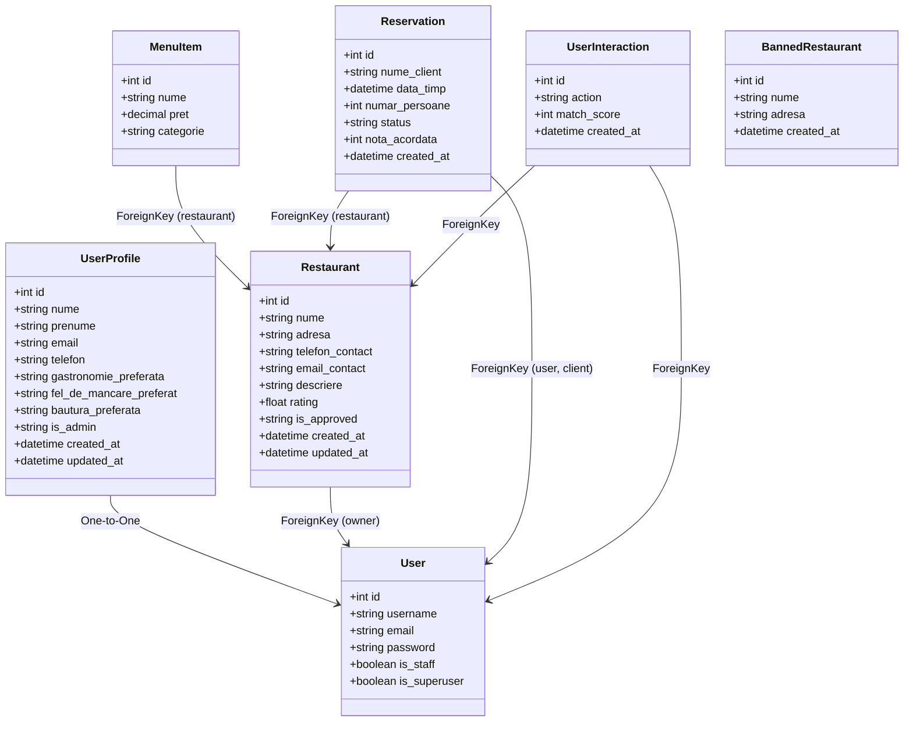
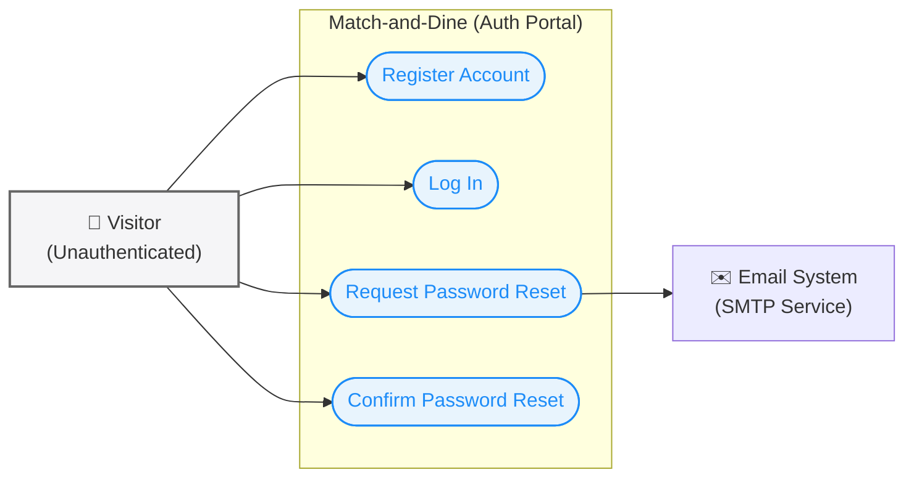
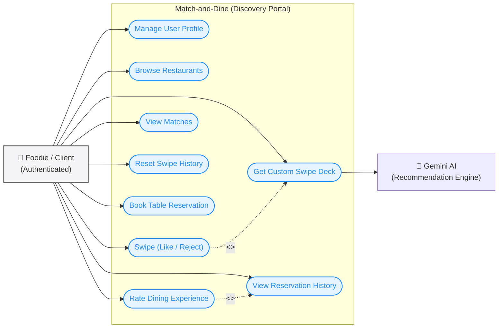
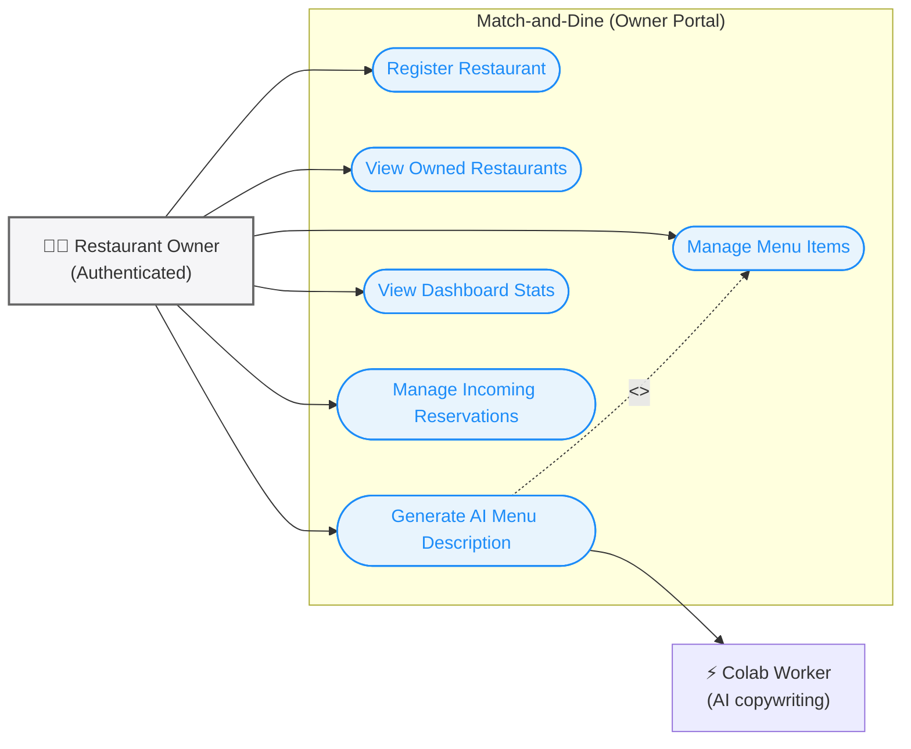
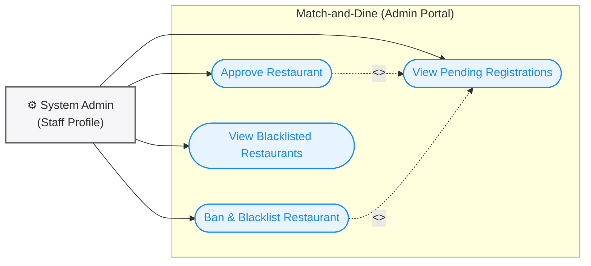
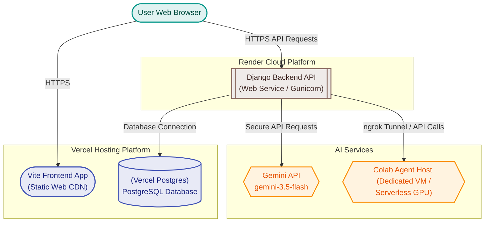

# Match-and-Dine

Match-and-Dine is a modern web application that simplifies the dining experience by matching hungry foodies with their ideal restaurants. It combines interactive social features with reservation systems and AI-powered recommendations.

---

## 🍽️ Overview + App Role

### Purpose of the Application
Match-and-Dine is designed to solve the age-old dilemma of deciding where to eat. By bringing a gamified swiping interface to food discovery, the application allows users to quickly browse local restaurants, swipe right on what appeals to them, and book table reservations instantly. For restaurant owners, it provides a portal to list their venues, update menu items, manage incoming reservations, and grow their customer base directly.

### Why Match-and-Dine is Different
Unlike traditional directory sites (like Yelp or TripAdvisor) which require manual searching, reading through lengthy reviews, and navigating cluttered interfaces, Match-and-Dine turns restaurant discovery into an interactive, Tinder-like experience. Backed by state-of-the-art Generative AI models, the app scores and serves customized restaurant decks based on specific cravings or natural language prompts (e.g., "I want a cozy Italian place for pasta"), making food selection personal, dynamic, and fun.

---

## 📋 Backlogs

### Agile Methodology & Backlogs
To develop the application efficiently and adapt to changing user feedback, our development team followed the Agile methodology. We structured our development cycles into iterative sprints and relied heavily on backlogs to organize user stories, prioritize bug fixes, and manage upcoming features. This structured workflow allowed us to deliver value incrementally and smoothly implement features like real-time swiping and automatic description generation.

### Backlog Ideas Placeholder
> [!NOTE]
> **Product Backlog & Future Iterations Placeholder**
> *   [ ] Implement real-time notifications for reservation status updates.
> *   [ ] Integrate interactive mapping (e.g., Google Maps API) to show nearby matches.
> *   [ ] Add group swiping rooms where friends or couples can swipe together to find a mutual dining match.
> *   [ ] Build a comprehensive dietary/allergy filter system.

---

## 🏗️ Architecture of the Entire Project

The application is split into a modern decoupled architecture, combining a React frontend with a Django REST API backend.



### Frontend Framework
The frontend is built using **React** powered by **Vite** for optimized building and hot-module replacement. 
*   **Communication with Backend**: The client application communicates asynchronously with the backend by executing HTTP requests via the browser's standard `fetch` API. Secure endpoints are protected using JWT (JSON Web Tokens). The frontend automatically extracts the token from `localStorage` and embeds it in the `Authorization` header as a `Bearer` token for authorized API calls.

### Backend Framework
The backend is built using the **Django** framework.
*   **Exposed Endpoints**: API endpoints are exposed through routing configuration in `core/backend/urls.py`, mapping specific request paths to Django views (in `core/backend/views.py`) that handle business logic, authenticate requests, and output JSON responses.
*   **Communication with Database**: Django's built-in **Object-Relational Mapper (ORM)** acts as the bridge between Python code and the SQLite database (`core/db.sqlite3`). SQL operations are abstracted through database models, facilitating transactions, migrations, and model relationships.

### Class Diagram (Django Models)



---

## 🤖 AI Agents

> [!NOTE]
> **AI Agents & Integrations Placeholder**
> * **Gemini Swiping Assistant**: Uses the `gemini-3.5-flash` model to analyze restaurant details, reviews, and menus dynamically, calculating matching scores based on user prompts.
> * **Colab Description Generator**: Offloads description generation tasks to a flask server run on Google Colab exposed via ngrok to produce high-quality, personalized copywriting for restaurants.

---

### 📝 Colab Description Generator: Architecture and Implementation

**1. What does this AI do?**
This agent takes primary data about a restaurant (name and cuisine/vibe) and automatically generates a short, coherent, and engaging description. To properly handle inputs from Romanian users, the pipeline uses the `deep-translator` library: it translates the received data into English to leverage the model's maximum capabilities, generates the text, and then translates the final description back into Romanian before sending it to the client.

**2. The Training Process (Fine-Tuning)**
For the AI to learn the exact structure and tone of the desired descriptions, it went through a Supervised Fine-Tuning (SFT) process.
* **Base Model:** `google/gemma-2-2b-it` was used, a lightweight and fast model optimized for instruction following.
* **Dataset:** The model was exposed to a JSONL file containing dozens of examples structured with `Instruction`, `Input` (name, cuisine), and `Output` (the ideal description).
* **Resource Optimization (PEFT & Quantization):** To enable training on a free graphics card (T4 GPU), the model was loaded in a 4-bit format (`BitsAndBytesConfig`). The LoRA technique was used to train only a fraction of the model's parameters (`q_proj`, `k_proj`, etc.), massively reducing memory requirements.
* **Storage:** The trained adapter was pushed publicly to the Hugging Face Hub (`Edy317/my_restaurant_aiv2`), allowing it to be downloaded later in just a few seconds.

**3. Evaluation Metrics and Generalization Capacity**
For a rigorous and scientifically valid evaluation, the model was tested exclusively on an unseen dataset from the training phase (avoiding Data Leakage or Overfitting). The mathematical scores obtained by comparing the generated texts with the ideal ones (*Ground Truth*) are:

| Metric | Value | Technical Interpretation for Documentation |
| :--- | :--- | :--- |
| **BLEU** | `0.0543` | The value reflects a low exact match at the n-gram level, which is absolutely normal and expected in creative text generation tasks. This score demonstrates that the model does not mechanically copy templates, but formulates new sentences, showing lexical flexibility. |
| **ROUGE-1** | `0.3394` | Indicates that ~34% of the unigrams (individual keywords, such as the venue name, cuisine type, or atmosphere elements) present in the ideal reference are successfully captured by the AI, ensuring high informational precision. |
| **ROUGE-L** | `0.2972` | Measures the Longest Common Subsequence. A score of nearly 30% confirms the success of the SFT process; the model correctly assimilated the syntax and grammatical structure specific to a commercial description. |

**4. Deployment (Flask & Ngrok)**
To connect the model (Google Colab) to the web application (Django):
* **Web Server (Flask):** Runs an application on port 5000, exposing the `/generate` endpoint capable of receiving POST requests (JSON with the restaurant's name and cuisine).
* **Filtering:** To prevent "hallucinations", the code processes the generated text: it stops at the first "Enter" (newline), ignores unwanted markdown formatting, cuts out expressions like "Explanation:", and ensures the text stops cleanly at the last valid period.
* **Public Tunnel (pyngrok):** Since the Google Colab virtual machine is completely isolated, `ngrok` is used to expose the Flask server on a public domain (e.g., `.ngrok-free.dev`). This URL acts as a temporary address to which the main backend can send data packets.

---

### 🧠 Gemini Swiping Assistant: Architecture and Implementation

**1. What does this AI do?**
Integrated directly into the application's logic (via the `api_swipe_deck` endpoint), this assistant takes the user's natural prompt (e.g., "I want something spicy" or "A good place for a date") and acts as an intelligent recommendation engine. Unlike a classic search through text filters that require exact word matches, Gemini semantically analyzes the information of each restaurant and generates a personalized feed (Tinder/Bumble style).

**2. Data Pre-processing and Contextualization**
To ensure a fluid and relevant experience, the Django backend sets the stage before querying the model:
* **History Exclusion:** Queries the database (`UserInteraction`) to automatically exclude restaurants the user has already voted on ("swiped left/right"), preventing the display of duplicates.
* **Data Serialization:** The available restaurants are aggregated into a structured JSON format containing the `id`, `name`, `description`, and an array with the items from the `menu`. This structure provides the AI with all the necessary context to make logical deductions (e.g., a restaurant that does not have its cuisine explicitly set as "Italian", but has "Spaghetti Carbonara" on the menu, will be recognized).

**3. Prompt Engineering & Smart Filtering**
The `gemini-3.5-flash` model is called via the `google.generativeai` SDK using a strictly controlled prompt:
* **Semantic Analysis ("Smart Filtering"):** The AI receives clear instructions not to limit itself to keyword matching. It is instructed to deduce associations (e.g., recommending a taqueria if the user asks for Mexican food).
* **Strict Limitation:** To optimize frontend performance, the AI selects a maximum of the 8 best matches. It completely eliminates restaurants that have no logical connection to the prompt.
* **Match Score:** To intelligently sort the results, the model evaluates the match quality and assigns a score between 1 and 100 (90-100 for perfect matches, 70-89 for related associations).
* **Format Forcing (JSON-only):** The AI is forbidden to return Markdown formatting or text like "Here are your recommendations". It is forced to respond strictly as a raw JSON array.

**4. Post-processing and Feed Generation**
To protect the application from potential formatting instabilities generated by the LLM:
* The backend uses Regular Expressions (`re.search`) to strictly isolate the JSON sequence `[ ... ]` from the Gemini response.
* Parsing extracts the `id`s and associates the `matchScore` with each one.
* The system retrieves the validated restaurants directly from the database, injects the AI score, and returns the descendingly sorted array to the frontend interface to be displayed as interactive cards.

## 🗺️ Use-Case Diagrams

Below are the use-case diagrams for the Match-and-Dine system, separated by user role to enhance visibility.

### 👤 Visitor Use Cases (Unauthenticated User)
Covers authentication and password recovery workflows.



### 🍔 Foodie Use Cases (Authenticated User)
Covers culinary discovery, swiping, matching, and table booking.



### 👨‍🍳 Restaurant Owner Use Cases
Covers restaurant registration, menu curation, statistics, and table bookings.



### ⚙️ System Administrator Use Cases
Covers restaurant validation, approvals, and blacklists.



---

## 🌐 Deployment and Infrastructure

To transition the project from local development to production, we plan to use a modern, scalable cloud hosting architecture.

### Future Deployment Strategy
*   **Vite Frontend Hosting**: Hosted on **Vercel** as a static, global CDN deployment to ensure super-fast delivery and automatic previews.
*   **Django Backend Hosting**: Hosted on **Render** as a persistent web service using Gunicorn.
*   **Production Database**: A managed **Vercel Postgres** (PostgreSQL) database instance. The Django backend on Render will connect securely to this database.
*   **AI Agent Deployment Solution**:
    *   **Gemini Swiping Assistant**: The API key will be configured as a secure environment variable on Render, enabling direct and authenticated communication from Django to the Google AI API.
    *   **Colab Description Agent**: To replace the temporary development-time Colab+ngrok tunnel, the description generator can be deployed on a dedicated GPU instance (such as a RunPod, AWS EC2 G-series instance, or Render background worker running a lightweight PyTorch/Transformers image) to ensure high availability and steady response times.

### Future Deployment Architecture



---

## ⚙️ Project Setup

Follow these instructions to set up and run the Match-and-Dine project locally.

### Prerequisites

Ensure you have the following installed:
*   [Python 3.8+](https://www.python.org/downloads/)
*   [Node.js and npm](https://nodejs.org/en/download/) (LTS recommended)

### Setup Installation

To install project dependencies, run the setup script matching your operating system from the project root:

#### For Windows Users
Open a Command Prompt or PowerShell and run:
```shell
setup.bat
```

#### For macOS and Linux Users
Open your terminal, make the script executable, and run it:
```shell
chmod +x setup.sh
./setup.sh
```

These scripts will:
1. Create a Python virtual environment in a `venv` directory.
2. Install python packages from `requirements.txt`.
3. Install frontend Node.js packages in `core/frontend`.

### Environment Configuration

The application requires a `.env` file to be created in the project root directory (the same directory where this `README.md` file is located). This file is used to store environment variables such as the Google Gemini API key.

Create a file named `.env` in the root directory and add the following content:

```env
GEMINI_API_KEY=YOUR_GEMINI_API_KEY_HERE
```

---

## 🚀 Running the Application

You can start both the Django backend and Vite frontend servers simultaneously using the provided startup scripts from the root directory:

### For Windows Users
Run the batch file in Command Prompt or PowerShell:
```shell
run.bat
```

### For macOS and Linux Users
Make the shell script executable (if not already) and run it:
```shell
chmod +x run.sh
./run.sh
```

---

### Alternative: Running Manually

If you prefer to run the servers in separate terminals manually:

1.  **Activate the virtual environment**:
    *   On Windows: `venv\Scripts\activate`
    *   On macOS/Linux: `source venv/bin/activate`

2.  **Run the Django backend server**:
    ```shell
    python core/manage.py runserver
    ```
    The backend API will be available at `http://127.0.0.1:8000/`.

3.  **Run the frontend development server**:
    Open a **new terminal**, navigate to the frontend directory, and run:
    ```shell
    cd core/frontend
    npm run dev
    ```
    The frontend will be accessible at the URL printed in the console (usually `http://localhost:5173`).
